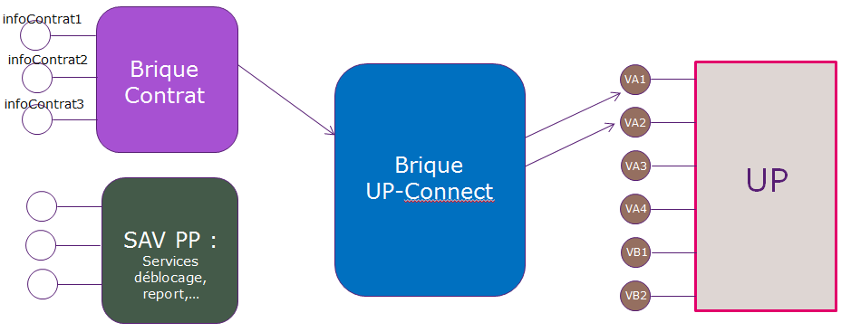

= Brique UP-CONNECT

== Introduction
Il s'agit d'une brique interfaçant l'ensemble des services UP.

L'intérêt de cette interface est multiple : ::
. Proposer un seul point d'accès aux services UP. Toute évolution UP n'impactera que cette brique.
. Masquer la complexité de question/réponse UP.
. Gérer la traduction de toutes les notions COBOL (les types notamment)
. Et, l'intérêt principal, permettre une gestion claire et souple des versions. Les changements de version des services UP ne doivent plus impacter nos projets et ne doivent plus engendrer des dépendances dans les projets. (Exemple M2CR et SAV CR)

== Architecture technique

La brique est développée au sein du Projet *S_BMP_999*.

L'interface UP-CONNECT porpose un ensemble de services web REST avec une notion importante de version. Ces services web seront appelés par les briques Middle uniquement.

Chaque service UP sera donc traduit sous forme d'un service REST.

Nous allons donc proposer une vision, identique en terme de contenu, différente de la commarea UP : 

.Exemple de réponse UP (Commarea Service Contrat V1, bloc Dossier)
----
R02UP-CONNECT     IMDCTR0 nx-?-1423475908972  CNF P2                            ?                   FRA1DCTR18                    ESCP ENC168CP7 000000000000é000000000000é01.01.0001000000016924H0000000000é02024000119002945905000000021413F000000000000é000000000000é005504119504570M16823080050001601.01.000116800001.01.0001NFINANCABLE     000000001586D000000000000é000000000000é001.01.000101.01.000101.01.000101.01.0001000000000000é000000000000è000000000000è000000000000é01.01.0001000000000000000000é000000                    000000000000é  
----

[source,json]
.Traduction par la brique UP-CONNECT
----
{
 "header": {
  "idErreurMainframe": "",
  "idFctAppelee": "?",
  "codePaysISO": "FRA",
  "codeRetourSimple": "0",
  "codeRetourPrecis": "DCTR17",
  "typeMessage": "R",
  "numVersionEntete": "01",
  "programmeJavaAppelant": "UP-CONNECT",
  "programmeMainframeAppele": "IMDCTR0",
  "idRequete": "nx-?-1423475908972",
  "typePasserelle": "C",
  "idPartenaire": "NF",
  "idCanal": "P"
  },
  "usineGestion": "ES",
  "typeProduit": "CP",
  "codePositionActuel": "ENC",
  "numSocFin": "168",
  "codeProduitComm": "UD7",
  "montantFinance": 182.32,
  "montantOffre": 182.32,
  "dateSignature": "19.11.2012",
  "montantTotalDu": 0,
  "nombreReportsEffectues": 0,
  "tncAnnuel": 0.8794,
  "taegActuel": 0.11,
  "numeroArchivage": "000119004122302",
  "capitalRestantDu": "000000000033B",
  "mensualiteEnCours": 31.32,
  "soldeRecouvrement": "000000000000é",
  "quantiemePrelevement": "005",
  "codeAgenceCommerciale": "504",
  "codeAgenceOctroi": "194",
  "codeAgenceSAV": "504",
  "codeAgenceGC": "585",
  "periodicite": "M",
  "numeroSocieteVendeur": "168",
  "numeroAgrementVendeur": "3491966",
  "nombreFinancements": 1,
  "datePremiereEcheance": "01.01.2001",
  "dateProchainJoker": "",
  "indicateurDtsActif": "",
  "indicateurFinancabilite": "",
  "montantDisponible": 0,
  "nouveauDMA": 0,
  "montantDMA": 0,
  "indicateurReconduction": "0",
  "dateProchaineReconduction": "",
  "dateAvantDernierArreteCompte": "",
  "dateDernierArreteCompte": "",
  "dateProchainArreteCompte": "",
  "montantMensualiteMinimum": 0,
  "montantAvantDernierArreteCompte": 0,
  "montantDernierArreteCompte": 0,
  "montantMensualiteClient": 0,
  "dureeInitiale": 6,
  "dureeRestante": 0,
  "dateFin": "05.05.2013",
  "dateProchaineEcheance": "",
  "montantProchaineEcheance": 0,
  "indicateurEchelonne": "N",
  "indicateurDiffere": "N"
 }
----

== Gestion des versions

IMPORTANT: UP ne gère que 3 versions d'un même service. Les versions développées par UP le sont pour l'ensemble de ses clients. Par conséquent nous n'avons aucune visibilité sur la durée de vie d'une version d'un service. Concrètement, un service en Production en versions 1,2,3 nécessite la création d'une Version4 et par conséquent la suppression de la version 1... Ce qui engendre nécessairement une évolution dans notre SI.

Certainement le point le plus important de la brique. L'objectif étant de proposer au travers de cette interface des services web versionnés non dépendants des versions des services UP. 

=== Exemple de situation
Pour expliquer le point sur les versions, je propose de prendre le cas d'utilisation suivant : ::

Supposons que UP nous mette à disposition un service "commercant" qui dans sa 1ère version nous propose 3 informations : pommes - poires - fraises. (On nommera cette version *CommercantUP1*) +
Nous proposons donc au niveau de la brique UP le service *CommercantV1* :

[source,json]
.CommercantV1
----
{
 "pommes" : "Reine des reinettes",
 "poires" : "Williams",
 "fraises" : "Gariguette"
}
----

Et nous avons une application de fruits qui propose d'afficher le type de ces 3 fruits à l'écran.

Supposons maintenant que pour le besoin d'une autre application de fruits et légumes, UP développe une nouvelle version de son service Commercant en y ajoutant des légumes : *CommercantUP5*. (Le choix du *5* est pour distingué les versions UP des versions de la brique UP-CONNECT) +
Nous proposons à présent au niveau d'UP-CONNECT le service *CommercantV2* : 

[source,json]
.CommercantV2
----
{
 "pommes" : "Reine des reinettes",
 "poires" : "Williams",
 "fraises" : "Gariguette",
 "choux" : "Cabus",
 "poivron" : "Pepper"
}
----

La nouvelle application Fruits et Légumes consommera donc ce nouveau service.

Supposons maintenant que UP supprime son service *CommercantUP1*. Nous (UP-CONNECT) devons continuer à faire vivre notre service *CommercantV1* afin de ne pas obliger l'application de Fruits seuls à évoluer. Pour ce faire, nous allons "connecter" *CommercantV1* sur *CommercantUP5* (en supposant une compatibilité ascendante) et créer un nouveau _Converter CommercantUP5-CommercantV1_. 
Il ne nous restera plus qu'à définir notre politique de gestion des durées de vie des versions dans UP-CONNECT (politique rendue complètement indépendante de la politique UP).

=== Fonctionnement technique

J'ai évoqué rapidement ci-dessus la notion de *converter*. Je détaille ici leur mode de fonctionnement.

La brique UP-CONNECT propose des services versionnés construits à partir de services UP également versionnés.

Pour résoudre le mapping entre les 2 versions exposés par UP d'un côté et UP-CONNECT de l'autre, nous allons mettre en place des converters.

NOTE: la notion de compatibilité est sous-entendue. Il est évident que si UP supprime une donnée en montant de version, nous ne serons plus en mesure d'assurer la restitution de cette donnée en passant à la nouvelle version. Ou alors nous forcerons à une valeur défaut cette donnée disparue. A voir en fonction des cas.

.Exemple
----
ObjetV1 <--> ConverterV1UP1 <--> ObjetUP1
ObjetV1 <--> ConverterV1UP5 <--> ObjetUP5
ObjetV1 <--> ConverterV1UP8 <--> ObjetUP8

ObjetV2 <--> ConverterV2UP8 <--> ObjetUP8
----

== Spécifications

=== Objets échangés
Je liste ci-dessous les objets échangés par exemple pour le service contrat V1 - UP1. +
V1 correspond à la version retournée par le service REST. +
UP1 correspond à la version du service UP.

----
InputContratV1 : Données envoyées par l'IHM
|
| ContratV1UP1InputConverter : Convertit un InputContratV1 en InputContratUP1
|
InputContratUP1 : Données nécessaires pour construire la requête UP (Données envoyées par IHM + données "en dur")
|
| ContratUP1RequestConverter
|
ContratUP1CommareaDescriptionRequest : Contient les données en entrée du service UP annotées pour l'étape de mashalling
	envoi de la question à UP
ContratUP1CommareaDescriptionResponse : Contient les données en sortie du service UP annotées pour l'étape d'unmarshalling.
|
| ContratUP1ResponseConverter
|
OutputContratUP1 : Données issues du retour du service UP auxquelles seront supprimées certaines données techniques(en tête par exemple)
|
| ContratV1UP1OutputConverter : Convertit un OutputContratUP1 en ContratV1
|
ContratV1 : L'objet contenant les données contrat dans sa version 1
----

=== Création d'un nouveau service

Listing des objets à créer pour une nouvelle fonctionnalité que l'on nommera "bank" pour laquelle nous exposons une version "V1" à partir d'une version UP "UP1":

----
Créer package com.natixis.cco.upconnect.modelnfi.bank
	Créer dedans :
	  	public class BankV1
		public class BankV1Header
		public class InputBankV1
----

----
Créer package com.natixis.cco.upconnect.modelUP.bank
	Créer dedans :
		public class BankUP1Header
		public class InputBankUP1
		public class OutputBankUP1
----
----
Créeer le package com.natixis.cco.upconnect.service.bank
	Créer de dans :
		public abstract class AbstractBankService<I,J extends UnitedCommareaDescriptionHeader,
							K extends UnitedCommareaDescriptionHeader,L> 
				extends AbstractUnitedService implements BankUPService<I, L>
		public interface BankUPService<I,L>
----
----
Créer package com.natixis.cco.upconnect.commarea.bank
	Créer dedans :
		/**
		 * Cette classe ajoute la description fonctionnelle à l'appel United service Bank version UP1.
		 */
		public class BankUP1CommareaDescriptionRequest extends UnitedCommareaDescriptionHeader
	
		
		public class BankUP1CommareaDescriptionResponse extends UnitedCommareaDescriptionHeader 
		public class BankUP1Description
Créer classe com.natixis.cco.upconnect.controller.BankController extends VersionController
Créer package com.natixis.cco.upconnect.converter.bank
	Créer dedans :
		public class BankUP1RequestConverter implements InputConverter<InputBankUP1, BankUP1CommareaDescriptionRequest>
		public class BankUP1ResponseConverter implements OutputConverter<BankUP1CommareaDescriptionResponse, OutputBankUP1>
		public class BankV1UP1InputConverter implements InputConverter<InputBankV1, InputBankUP1>
		public class BankV1UP1OutputConverter extends UPResponseConverter<OutputBankUP1, BankV1>
----
----
Créer package com.natixis.cco.upconnect.manager.bank
	Créer dedans :
		public abstract class AbstractBankManager<T,V,U,S> implements IVersionManager 
		public class Bank1UP1Manager extends AbstractBankManager<InputBankV1, InputBankUP1, OutputBankUP1, BankV1>
----	

----
Créer le package com.natixis.cco.upconnect.service.bank.up1
	Créer dedans :
		public class BankUP1Codes
		public abstract class BankUP1Service
				extends
				AbstractBankService<InputBankUP1, BankUP1CommareaDescriptionRequest, 
										BankUP1CommareaDescriptionResponse, OutputBankUP1>
		public class BankUP1ServiceImpl extends BankUP1Service
		public class BankUP1ServiceMock extends BankUP1Service 
----

Ensuite il faut compléter les attributs des classes d'échange.
		

== Les services exposés

=== Le service Contrat V1
Il s'agit du bloc *dossier* du service contrat UP.

.Liste des codes retour dits "fonctionnels" UP
[cols="1,1,3", options="header"]
|===
|Codes retour |Code retour REST |Description UP
|DCTR04 |404 |Contrat non trouvé
|DCTR08 |404 |Contrat non trouvé
|DCTR10 |404 |Contrat non trouvé
|DCTR12 |404 |Contrat non trouvé
|DCTR14 |404 |Contrat non trouvé
|DCTR16 |404 |Contrat non trouvé
|DCTR18 |404 |Contrat non trouvé
|DCTR22 |404 |Contrat non trouvé
|DCTR36 |404 |Contrat non trouvé
|===

=== Le service Contrat V2
Il s'agit du bloc *dossier* du service contrat UP.

.Liste des codes retour dits "fonctionnels" UP
[cols="1,1,3", options="header"]
|===
|Codes retour |Code retour REST |Description UP
|DCTR04 |404 |Contrat non trouvé
|DCTR08 |404 |Contrat non trouvé
|DCTR10 |404 |Contrat non trouvé
|DCTR12 |404 |Contrat non trouvé
|DCTR14 |404 |Contrat non trouvé
|DCTR16 |404 |Contrat non trouvé
|DCTR18 |404 |Contrat non trouvé
|DCTR22 |404 |Contrat non trouvé
|DCTR36 |404 |Contrat non trouvé
|===

=== Le service Rachat V1

.Liste des codes retour dits "fonctionnels" UP
[cols="1,1,3", options="header"]
|===
|Codes retour |Code retour REST |Description UP
| |404 |Contrat non trouvé
|===

=== Le service Agence V1

.Liste des codes retour dits "fonctionnels" UP
[cols="1,1,3", options="header"]
|===
|Codes retour |Code retour REST |Description UP
|DAGE01 |500 |Numéro agence non renseigné
|DAGE02 |500 |Numéro agence non numérique
|DAGE03 |404 |Agence non trouvé (TBORAGC)
|DAGE04 |500 |Problème accès table TBORAGC
|DAGE05 |404 |Agence non trouvé (TBORDAG)
|DAGE06 |500 |Problème accès table TBORDAG
|===

=== Le service DMEN V1

.Exemple d'appel au service
----
{
  "modeAppel": "SAV",
  "degressivite": 555,
  "codeBareme": 3,
  "tauxAssurance": 0,
  "montantFinancement": 0,
  "montantReglement": 0,
  "nbEchSouhaitee": 0,
  "cma": 0,
  "dureeMaxFormule": 0,
  "codeSocieteComm": 0,
  "numeroDossier": "45263256356985",
  "nbJokerReport": 0,
  "baremes": [
    {
      "tncAnnuel": 0.54,
      "decouvertMin": 100.00,
      "decouvertMax": 0
    },
    {
      "tncAnnuel": 0.65,
      "decouvertMin": 150.00,
      "decouvertMax": 0
    }
  ]
}
----

NOTE: Si tout s'est bien passé côté UP, les données de réponse peuvent être accompagnées d'un message informatif. Nous stockerons ce message dans le champ *libelleInformatif*. Et nous stockerons sous *codeInformatif* (en alpha-numérique) un code permettant d'identifier le libellé. Ci-après la liste de ces messages. Le seul cas où aucun message informatif n'accompagne la réponse UP est le code DMEN00.

.Messages informatifs
[cols="1,3,1", options="header"]
|===
|Codes retour |LibelléInformatif |CodeInformatif
|DMEN00 | |0
|DMEN44 |La durée en entrée n’est compatible RCC |1
|DMEN50 |La mensualité appliquée est la mensualité plancher |2
|DMEN51 |La mensualité appliquée est la mensualité maximale autorisée |3
|DMEN53 |Mensualité Calculée |4
|DMEN57 |Mensualité réajustée |5
|DMEN82 |Pas de la mensualité non renseigné,forcé à 1 |6
|DMEN84 |Nb d’échéance < au nombre d’échéance demandé |7
|===

.Gestion des codes retour UP à prendre en compte
[cols="1,1,3", options="header"]
|===
|Codes retour |Code retour REST |Description UP
|DMEN28 |404 |Dossier non trouvé
|DMEN29 |404 |Dossier non trouvé
|DMEN30 |404 |Dossier non trouvé
|DMEN31 |404 |Dossier non trouvé
|DMEN32 |404 |Code société non trouvé
|===

Les erreurs liées à des données en entrée ne respectant pas le format attendu seront traduites en erreur 400 ("Bad Request").

Tout autre code retour sera transformé en erreur 500 avec le code DMENXX en libellé pour les logs du consommateur.